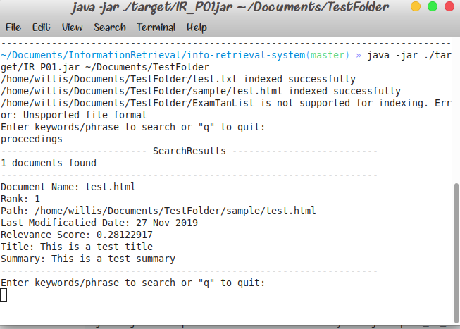

# Information Retrieval System
This is a console java application which indexes files and directories and allows users to execute boolean queries on them.

## Requirements
 - jdk(version 8 or higher)
 - JAVA_HOME environment variable set to <path_to_jdk>
 - maven(version 3 or higher)
 
## Building Maven Dependencies
### Compile Resources
Gathers dependencies specified in pom.xml and create classpaths for it. This also creates .class files from source .java files.
```shell
mvn compile
```
### Build Package
Creates jar from the compiles class files.
```shell
mvn clean package
```
## Execute jar
Run jar with path to a directory or a file to be indexed as an argument.
```shell
java -jar ./template/informationRetrievalSystem.jar <path_to_directory_or_file>
```

## Sample Results

 
